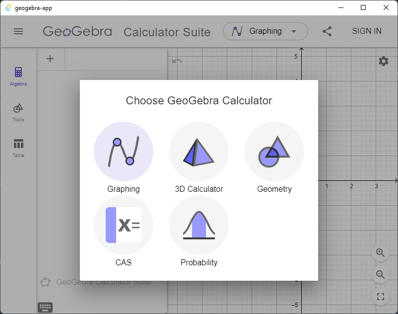
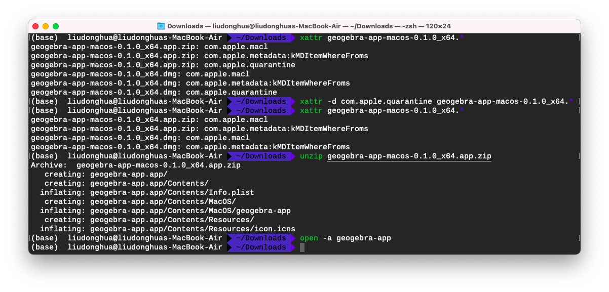

# geogebra-app

This is yet another geogebra desktop app, running in an [Tauri](https://tauri.studio/) app. The static files are extracted from `GeoGebra Classic` desktop app.

## Downloads

<table class="is-fullwidth">
</thead>
<tbody>
</tbody>
  <tr>
    <td>
       
      Windows
    </td>
    <td>
      64-bit
      <a href="https://github.com/liudonghua123/geogebra-app/releases/download/0.1.0/geogebra-app-windows-0.1.0_x64.exe">
        📦 Executable
      </a> |
      <a href="https://github.com/liudonghua123/geogebra-app/releases/download/0.1.0/geogebra-app-windows-0.1.0_x64.msi">
        💿 MSI Installer
      </a> 
      32-bit
      <a href="https://github.com/liudonghua123/geogebra-app/releases/download/0.1.0/geogebra-app-windows-0.1.0_x86.exe">
        📦 Executable
      </a> |
      <a href="https://github.com/liudonghua123/geogebra-app/releases/download/0.1.0/geogebra-app-windows-0.1.0_x86.msi">
        💿 MSI Installer
      </a> 
      
        ❓ Don't know what kind of chip you have? Hit start, enter "processor" for info.
      
    </td>
  </tr>
  <tr>
    <td>
       
      macOS
    </td>
    <td>
      Intel Processor
      <a href="https://github.com/liudonghua123/geogebra-app/releases/download/0.1.0/geogebra-app-macos-0.1.0_x64">
        📦 Executable
      </a> |
      <a href="https://github.com/liudonghua123/geogebra-app/releases/download/0.1.0/geogebra-app-macos-0.1.0_x64.dmg">
        💿 DMG bundle
      </a> |
      <a href="https://github.com/liudonghua123/geogebra-app/releases/download/0.1.0/geogebra-app-macos-0.1.0_x64.app.zip">
        💿 APP bundle
      </a> 
      Apple M1 Processor
      <a href="https://github.com/liudonghua123/geogebra-app/releases/download/0.1.0/geogebra-app-macos-0.1.0_aarch64">
        📦 Executable
      </a> |
      <a href="https://github.com/liudonghua123/geogebra-app/releases/download/0.1.0/geogebra-app-macos-0.1.0_aarch64.dmg">
        💿 DMG bundle
      </a> |
      <a href="https://github.com/liudonghua123/geogebra-app/releases/download/0.1.0/geogebra-app-macos-0.1.0_aarch64.app.zip">
        💿 APP bundle
      </a> 
      
        ❓ Don't know what kind of chip you have? Learn more at <a href="https://support.apple.com/en-us/HT211814">apple.com</a>.
      
    </td>
  </tr>
  <tr>
    <td>
       
      Linux
    </td>
    <td>
      64-bit
      <a href="https://github.com/liudonghua123/geogebra-app/releases/download/0.1.0/geogebra-app-linux-0.1.0_amd64">
        📦 Executable
      </a> |
      <a href="https://github.com/liudonghua123/geogebra-app/releases/download/0.1.0/geogebra-app-linux-0.1.0_amd64.AppImage">
        💿 AppImage bundle
      </a> |
      <a href="https://github.com/liudonghua123/geogebra-app/releases/download/0.1.0/geogebra-app-linux-0.1.0_amd64.deb">
        💿 DEB bundle
      </a>
    </td>
  </tr>
</table>

## Does it work?

Yes! Quite well, actually - on macos, Windows, and Linux.

Notes: For macos users, If you do not want to open security settings to reopen the app, you could remove `com.apple.quarantine` metadata (see also [Safely open apps on your Mac](https://support.apple.com/en-us/HT202491), [How to disable the quarantine popup in macOS Big Sur](https://hiringengineersbook.com/post/disable-quarantine/)) for the downloaded files.

## Credits

99% of the work was done over at [geogebra](https://github.com/geogebra/geogebra).

## License

MIT License

Copyright (c) 2022 liudonghua
